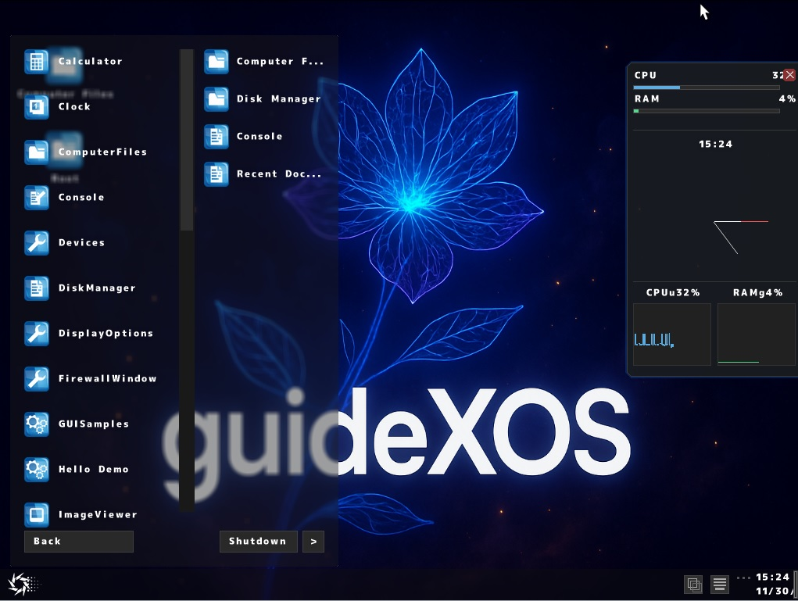
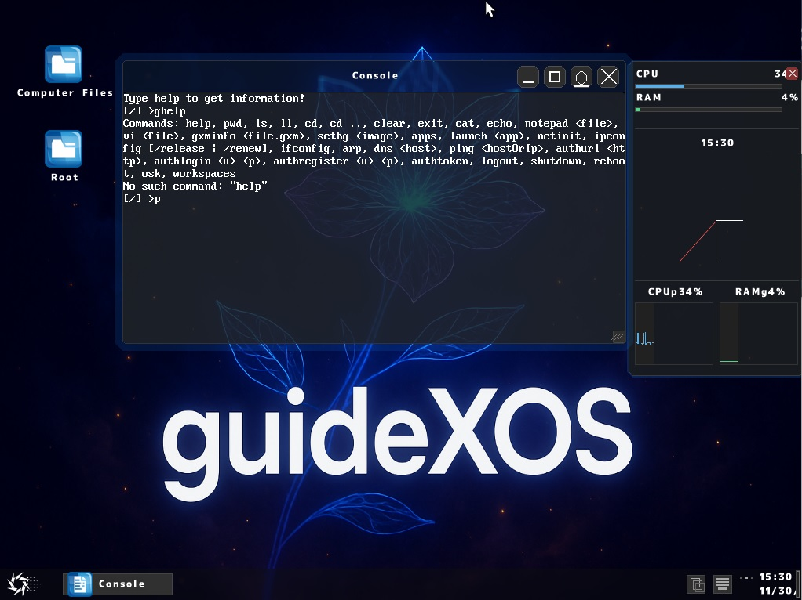
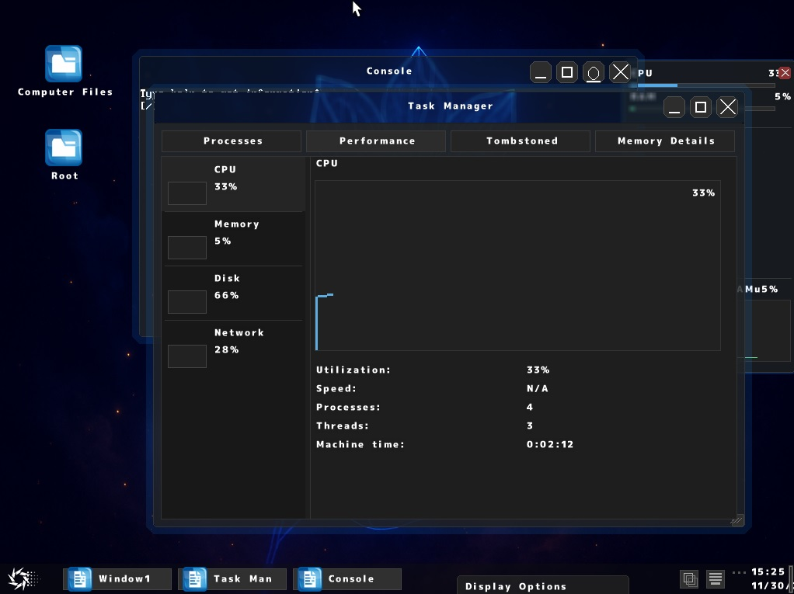
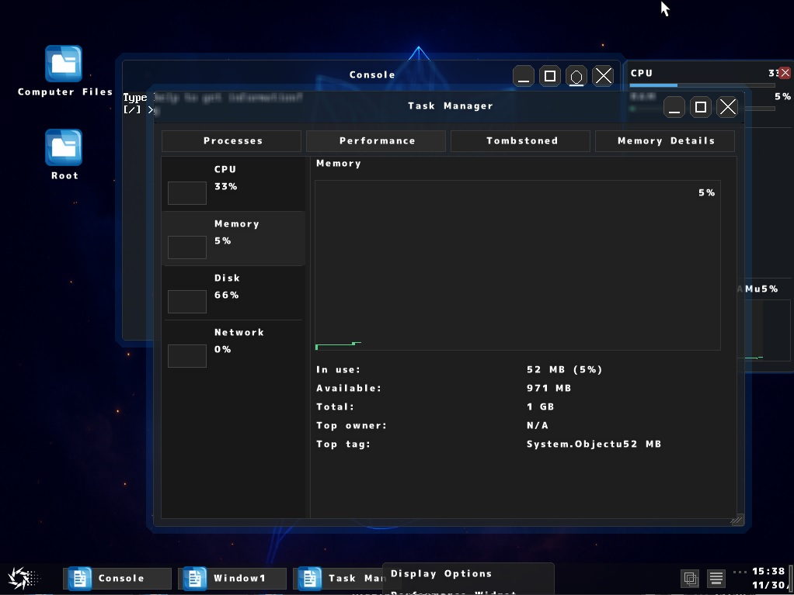
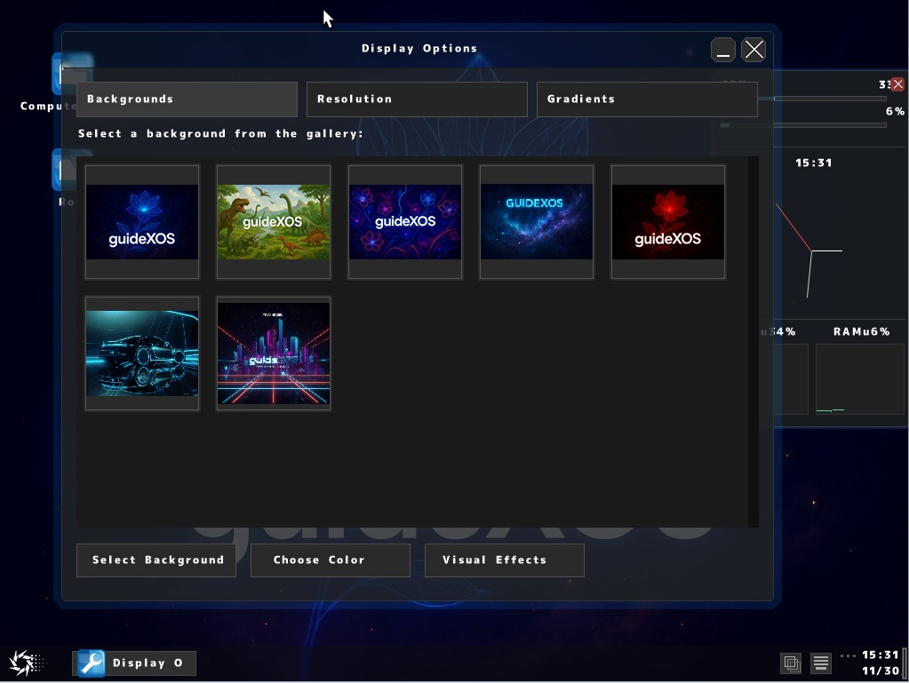
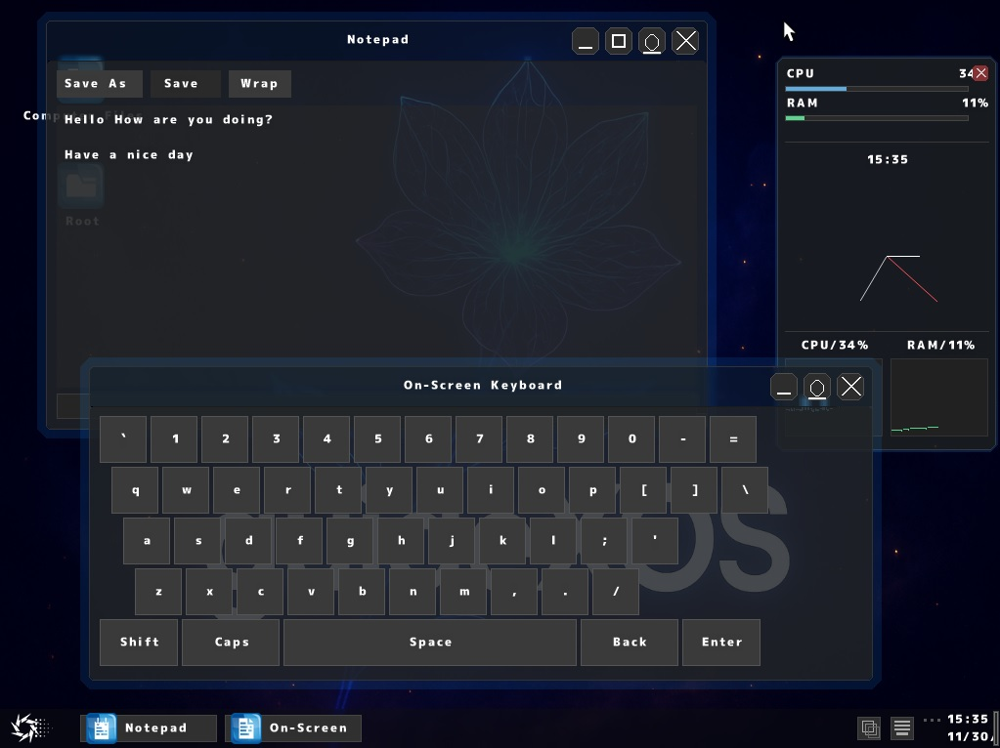
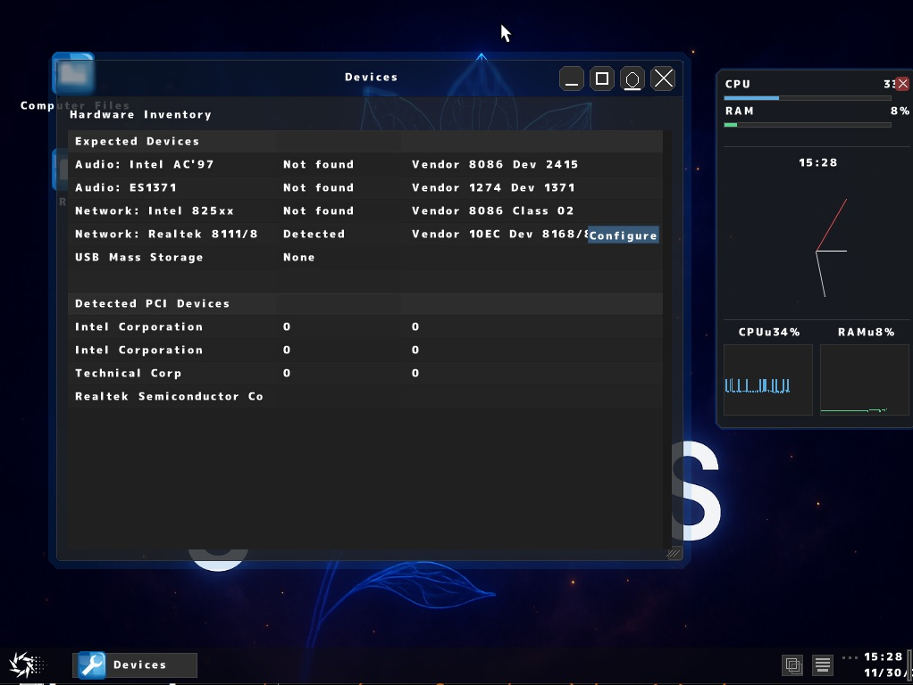

# guidexos
<h1>An operating system written entirely in C#</h1>

<h3>Splash Screen</h3>

<h3>Console</h3>

<h3>Task Manager Performance Tab/CPU</h3>

<h3>Task Manager Performance Tab/Memory</h3>

<h3>Display Options</h3>

<h3>Notepad/On Screen Keyboard</h3>

<h3>Devices Inventory</h3>

